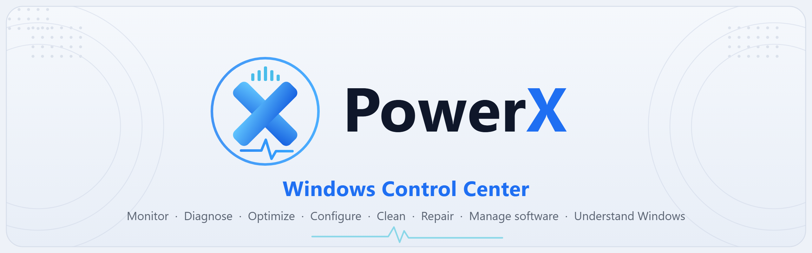
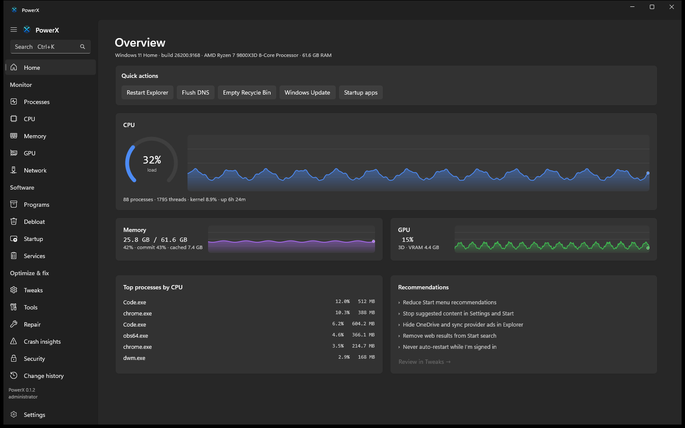
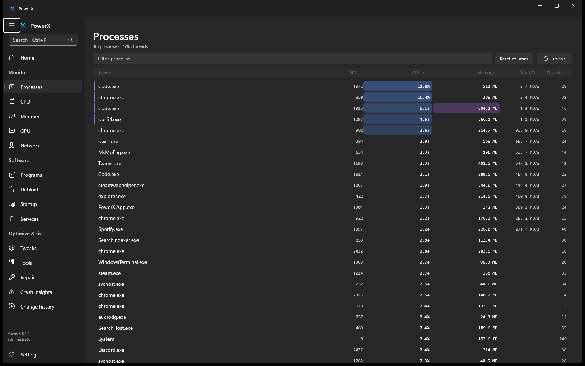
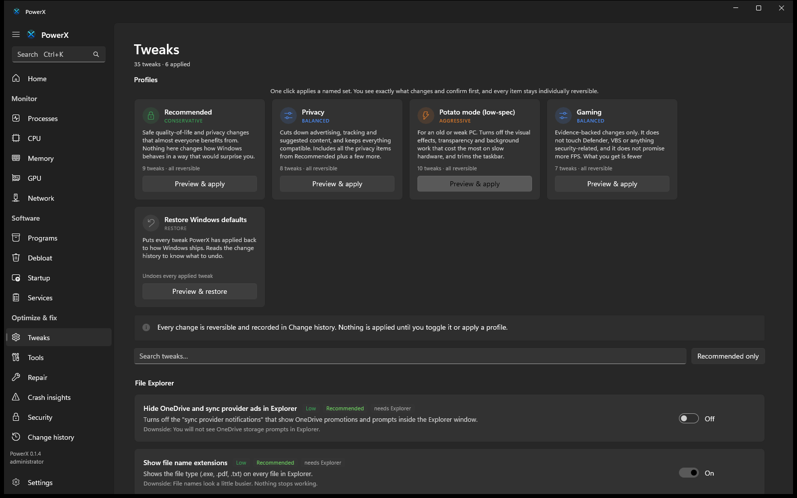
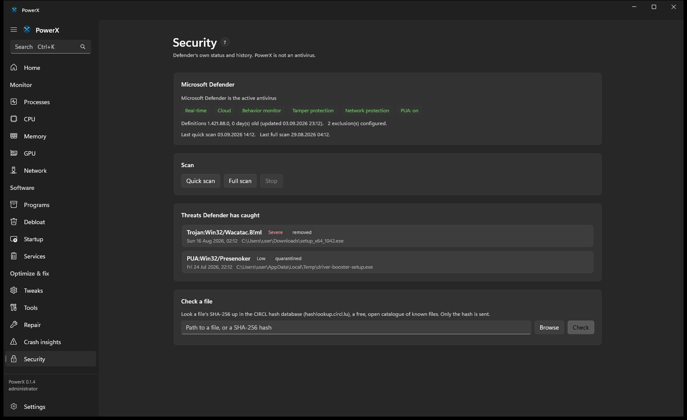

<p align="center">
  
</p>

<p align="center">
  <a href="https://github.com/Nowalski/Power-X/releases/latest"></a>
  <a href="https://github.com/Nowalski/Power-X/releases"></a>
  <a href="https://github.com/Nowalski/Power-X/actions/workflows/ci.yml"></a>
  <a href="LICENSE"></a>
  
  
</p>

<p align="center">
  <b><a href="https://github.com/Nowalski/Power-X/releases/latest">Download</a></b> &nbsp;&middot;&nbsp;
  <a href="https://nowalski.github.io/Power-X/">Website</a> &nbsp;&middot;&nbsp;
  <a href="https://github.com/Nowalski/Power-X/releases">What's new</a> &nbsp;&middot;&nbsp;
  <a href="docs/PRODUCT_SPEC.md">Product spec</a> &nbsp;&middot;&nbsp;
  <a href="docs/DECISIONS.md">Decisions</a>
</p>

---

**PowerX** is a native Windows control center: Task Manager, System Informer, Autoruns, a debloater and a tweak engine, unified into one WinUI 3 app. It treats deep system monitoring, *safe* configuration, and premium Windows-native design as equally important, and stays useful even if you never remove a single app.

> **Status: 0.1.19, an early milestone build.** Working today on real Windows data: `PowerX.Core` (telemetry, a declarative tweak engine, debloat / startup / services inventories, cleanup and repair engines, crash insights, a system report, an append-only change history), the `powerx` CLI, and a WinUI 3 desktop app with live dashboards, one-click **profiles**, a network view with listening ports, a Security page and a diagnostics runner.

<p align="center">
  
  
</p>
<p align="center">
  
  
</p>

## Download

Grab the latest build from the [releases page](https://github.com/Nowalski/Power-X/releases/latest).

| | |
|---|---|
| **Installer** | `PowerX-Setup-<version>-win-x64.msi`. Per-machine install to Program Files, a Start-menu entry and a desktop shortcut, clean uninstall, in-place upgrade. |
| **Portable** | `PowerX-<version>-portable-win-x64.zip`. Unpack and run `PowerX.App.exe`. Nothing is written outside the folder except a small change history and settings under `%LOCALAPPDATA%\PowerX`. |

Requirements: 64-bit Windows 10 build 19041 or Windows 11. PowerX runs as administrator because it manages system state. It is **not code-signed yet**, so SmartScreen shows an "unknown publisher" prompt: choose *More info*, then *Run anyway*. Each release lists a SHA-256 for every file so you can verify what you downloaded.

## What it does

| Area | |
|---|---|
| **Health check** | Scans everything below and lists what's worth doing, most impactful first: pending restart, no active antivirus, firewall holes, disk space and health, broken startup entries, boot slowdown, driver age, battery wear, event-log criticals, recent crashes, unapplied recommended tweaks. Every item just points at the page that fixes it; nothing here changes anything by itself. |
| **Monitor** | Real-time CPU (total, per-core, kernel time), memory (physical, commit, pools, cache), GPU (engine and VRAM via PDH, with a real per-adapter breakdown on a multi-GPU machine instead of one blended number), temperatures (ACPI thermal zones plus per-disk sensors; Windows exposes no CPU or GPU sensor without a vendor SDK, so those are left out rather than faked), network throughput and connections, processes (single-syscall enumeration, per-process CPU, I/O, memory, handles, threads, a real tree, and a plain-language "what is this" note), disks (SMART, temperature, endurance). |
| **Configure** | A **declarative, evidence-backed tweak engine** (35 tweaks). Every tweak states what it does, why you might want it, the downside, restart needs, whether it is reversible, and whether it is recommended. Curated **profiles** (Recommended, Privacy, Potato mode, Gaming, Restore defaults) apply a visible set in one click with a preview diff. No folklore gamer tweaks ([why](docs/research/TWEAK_RESEARCH.md)). |
| **Debloat** | About ninety curated entries, Store and consumer apps only, no shell components, nothing pre-selected. Each entry states its removal class and how hard it is to reinstall. |
| **Startup & tasks** | Every autostart entry in one list with reversible toggles, a flag on entries whose program no longer exists (removable in one click), boot-performance data (last-boot duration, versus your average, per-entry impact from the same source Task Manager uses), a "delay after sign-in" option for a slow entry, and a curated Scheduled Tasks view with a stance on the well-known telemetry and updater tasks. |
| **Drivers & firewall** | A driver inventory that flags drivers three or more years old or unsigned (never installs anything), and a **read-only** firewall-rules view that flags a broad inbound-allow hole. |
| **Event log** | Recent Application and System errors grouped by source and id, with a plain-language note for the common ones. |
| **Clean and repair** | Size-first disk cleanup with a per-category breakdown, a component-store (WinSxS) analysis with the safe Microsoft cleanup, and a runner for SFC, DISM, chkdsk, network reset and Windows Update repair with streamed output. |
| **Storage explorer** | Point it at a drive or folder and it sizes every child recursively, largest first, streaming results in as each folder is measured; click to drill down. Junctions and symlinks are skipped. |
| **What changed** | A daily background snapshot of your configuration (startup entries, scheduled tasks, services, programs, drivers, tweaks) with an added / removed / changed diff between any two. Local-only JSON. |
| **Share this setup** | Export the tweaks you have applied to a small file, apply them on another PC behind a preview. |
| **Crash insights** | Reads what Windows already recorded (WER, event logs, and only on request the metadata inside a crash dump) and separates observed facts from likely cause, with a confidence level. Never downloads symbols, never opens a dump in a debugger, never uploads anything. |
| **Network** | Live up and down rate, per-process connections with remote address and state, a listening-ports view that flags what is reachable from the network, opt-in reverse DNS for public addresses, built-in ping / traceroute / DNS, (elevated) which process is using the bandwidth right now, and enabling or disabling an adapter. |
| **Security check** | PowerX is not an antivirus. This shows Microsoft Defender's real status and the threats it has caught, starts a Defender scan, and checks a file's SHA-256 against the open CIRCL hash database. |
| **System report** | `powerx report` or a Settings button writes hardware, OS, storage, applied tweaks, recent changes and an event-log and crash summary to one file for support. The user name, machine name and MAC addresses are redacted, and you see the full text first. Plus battery health and a pending-restart check. |
| **Safety** | Detect, record, plan, show, apply, **verify**, log, undo. An append-only change history. Per-tweak revert. Honest about what cannot be undone. |

## Try the CLI

```
git clone https://github.com/Nowalski/Power-X && cd Power-X
dotnet build
dotnet run --project src/PowerX.Cli -- status
dotnet run --project src/PowerX.Cli -- process list --sort cpu --top 20
dotnet run --project src/PowerX.Cli -- scan
dotnet run --project src/PowerX.Cli -- tweak show privacy.advertising-id
dotnet run --project src/PowerX.Cli -- profile apply lowspec --dry-run
dotnet run --project src/PowerX.Cli -- crashes --since 7d
dotnet run --project src/PowerX.Cli -- report --print
dotnet run --project src/PowerX.Cli -- security
dotnet run --project src/PowerX.Cli -- hash C:\Windows\System32\curl.exe
dotnet run --project src/PowerX.Cli -- changes
dotnet run --project src/PowerX.Cli -- storage C:\Users
dotnet run --project src/PowerX.Cli -- reboot
dotnet run --project src/PowerX.Cli -- battery
dotnet run --project src/PowerX.Cli -- temps
dotnet run --project src/PowerX.Cli -- tasks --telemetry
dotnet run --project src/PowerX.Cli -- drivers --old
dotnet run --project src/PowerX.Cli -- firewall
dotnet run --project src/PowerX.Cli -- events --24h
dotnet run --project src/PowerX.Cli -- config export my-setup.json
dotnet run --project src/PowerX.Cli -- doctor
dotnet run --project src/PowerX.Cli -- history
```

The CLI and the GUI call the **same** `PowerX.Core`. Tweak logic is never duplicated.

## Build

- 64-bit Windows 10 build 19041 or Windows 11
- .NET SDK 10.0.400 or newer (`global.json` pins it; `rollForward: latestFeature`)
- `dotnet build` and `dotnet test` for Core and CLI, no Visual Studio required
- The WinUI app: `dotnet build src/PowerX.App/PowerX.App.csproj -p:Platform=x64` (no workload, no Visual Studio)

### Installer

The MSI is built from [`installer/PowerX.wxs`](installer/PowerX.wxs) with WiX 5:

```
dotnet tool install --global wix --version 5.0.2
wix extension add -g WixToolset.UI.wixext/5.0.2
pwsh installer/build.ps1        # -> publish/PowerX-Setup-<version>-win-x64.msi
```

The app itself is unpackaged and unchanged. The MSI only lays down the self-contained publish folder, with the Visual C++ runtime bundled so it starts on a clean Windows install.

## Repository

```
src/PowerX.Core    telemetry, tweak engine, profiles, debloat, cleanup, repair, transactions, diagnostics   (no UI deps)
src/PowerX.Cli     powerx.exe
src/PowerX.App     WinUI 3 desktop app (unpackaged, x64), built separately from PowerX.sln
installer/         WiX 5 source for the MSI
site/              the homepage published to GitHub Pages
bench/             BenchmarkDotNet harness for telemetry hot paths
tests/             xUnit + FluentAssertions
docs/              spec, architecture, design system, decisions, research
```

## Principles

- **Tell the truth.** Real telemetry or "unavailable"; no fabricated zeros; no unverified FPS claims.
- **Least *unnecessary* software**, not the lowest process count.
- **Progressive disclosure.** Simple by default, deep on demand. Simple is not crippled.
- **Weakening a security boundary is never "optimization"** and never in a default profile.
- **The tool must not be the resource hog.**

## Updates

PowerX checks a small `version.json` in this repo once a day (opt-out in Settings). When a release has a hash-pinned installer it can download and run it after you confirm; otherwise it just points you at the releases page. It only ever fetches from this repo's own GitHub releases over HTTPS and verifies the size and SHA-256 before running anything.

## Support the project

PowerX is free and MIT-licensed, built in the open by one person. If it saved you time, [**GitHub Sponsors**](https://github.com/sponsors/Nowalski) helps pay for a code-signing certificate (so the SmartScreen warning goes away for everyone) and the time to keep building. Starring the repo and filing good bug reports helps just as much.

## Licence

**MIT.** See [`LICENSE`](LICENSE). No GPL or restricted code is imported; referenced projects are studied for behaviour and reimplemented from Microsoft documentation. Third-party components are listed in [`THIRD-PARTY-NOTICES.md`](THIRD-PARTY-NOTICES.md).

## Contributing

See [`CONTRIBUTING.md`](CONTRIBUTING.md), especially *Adding a tweak*, which has a hard checklist: evidence, build range, revert, test, docs.

<p align="center"><sub>Not affiliated with Microsoft. Windows is a trademark of Microsoft Corporation.</sub></p>
